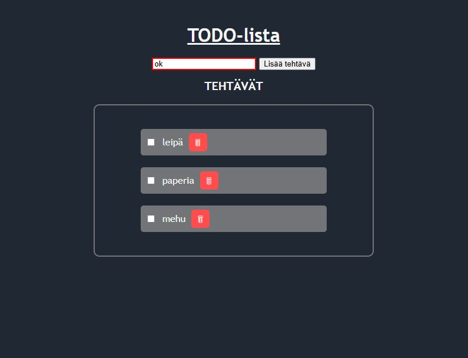

# Projekti 1: TODO-lista
Marianna Raitamaa ja Emilia Ahti

## Demo linkki:

https://mariannaraitamaa.github.io/DOM-skriptaus/

https://dom-skriptaus.netlify.app/

## Miten työ on toteutettu

Projekti on toteutettu yhteistyöllä sovittuina tapaamisaikoina teamsin välityksellä.

## Table of Content:

- [Sovelluksen esittely](#about-the-app)
- [Kuva sovelluksesta](#screenshots)
- [Käytetyt teknologiat](#technologies)
- [Lähteet](#credits)

## Sovelluksen esittely

TODO-lista on yksinkertainen sovellus, johon voit koota oman tehtävälistan, esimerkiksi vaikka kauppalistan.

Listalle on mahdollisuus lisätä tehtävät/asiat omille riveilleen ja ne on mahdollista merkata tehdyksi tehtävän

edessä olevasta laatikosta, jolloin laatikko muuttuu siniseksi, siihen ilmestyy väkänen ja tehtävä yliviivataan.

Tehtävä on mahdollista myös poistaa kokonaan tehtävän perässä olevasta roskispainikkeesta.

Listaan voi lisätä sanoja, joissa on vähintään kolme kirjainta, sitä lyhyemmät sanat tai tyhjä syöte

saavat aikaan alert-ponnahdusikkunan maininnalla "sana on liian lyhyt" ja syötekentän

reunat muuttuvat punaiseksi.

## Kuva sovelluksesta

## Käytetyt teknologiat

Projektin toteutuksessa on käytetty html, css ja javascriptiä.

<ul>
  <li>HTML on käytetty sovelluksen rakenteen määrittelyyn,</li>
  <li>CSS on käytetty sovelluksen ulkoasun ja asettelun määrittelyyn ja</li>
  <li>Javascriptiä on käytetty sovelluksen interaktiivisuuden luomiseen.</li>
</ul>

Tehtävälistan tiedot tallennetaan localstorageen.

## Lähteet

Lähteinä käytetty tuntimateriaalia, w3Schoolin materiaaleja ja koodin tarkistukseen chatgpt.

